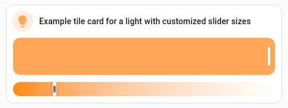

Adjustable card features for Home Assistant
===========================================

Allows style customizations for Home Assistant card features. Most notably, you
can change a feature's size or color.

Implemented as a Home Assistant card feature that wraps another card feature as
a subfeature and sets style declarations for it.




Installation
------------

### Using [HACS][] ###

Install from [custom repository][hacs-customrepo]. In HACS dashboard, open
top-right menu, select "Custom repositories", and enter the following:

- Repository: `https://github.com/pekman/lovelace-adjustable-card-feature.git`
- Type: Dashboard

### Manually ###

``` sh
npm install
npm run build
```

Copy and register the file `dist/adjustable-card-feature.js` according to
[Home Assistant's documentation about registering resources][hass-resources].


Configuration
-------------

Graphical configuration is not supported; only YAML configuration is possible.

Options:

| Name         | Type    | Description                               |
|--------------|---------|-------------------------------------------|
| `type`       | string  | `custom:adjustable-card-feature`          |
| `subfeature` | mapping | Subfeature configuration; `type` required |
| `style`      | string  | CSS declarations (no selectors)           |

`subfeature` should contain subfeature options as described in
[Home Assistant documentation][hass-features].

Suggested steps for half-graphical configuration:

1. Add and configure a card feature in the graphical card configuration as
   usual.

2. Add a new adjustable feature.

3. Edit card configuration as YAML. Move the new feature's configuration under
   the adjustable feature's `subfeature` key. (Don't include the "-"; it's not a
   list.)

3. Add styles under `style` key. Its value should be a string containing CSS
   declarations (no selectors), including variable declarations, which Home
   Assistant uses for a lot of styling.

Notable CSS variables to adjust:
   
- `--feature-height: 42px;`
- `--feature-button-spacing: 12px;`
- `--feature-color: #4a412a;`

### Example ###

To create a card like in the image above, start editing a dashboard, click "Add
card", choose type "Manual", and enter the following:

``` yaml
type: tile
name: Example tile card for a light with customized slider sizes
entity: light.YOUR_LIGHT_ENTITY_that_supports_color_temp
icon: mdi:lightbulb
vertical: false
hide_state: true
features:
  - type: custom:adjustable-card-feature
    subfeature:
      type: light-brightness
    style: |-
      --feature-height: 63px;
  - type: custom:adjustable-card-feature
    subfeature:
      type: light-color-temp
    style: |-
      --feature-height: 24px;
```


[HACS]: https://www.hacs.xyz/
[hacs-customrepo]: https://hacs.xyz/docs/faq/custom_repositories/
[hass-resources]: https://developers.home-assistant.io/docs/frontend/custom-ui/registering-resources
[hass-features]: https://www.home-assistant.io/dashboards/features/
